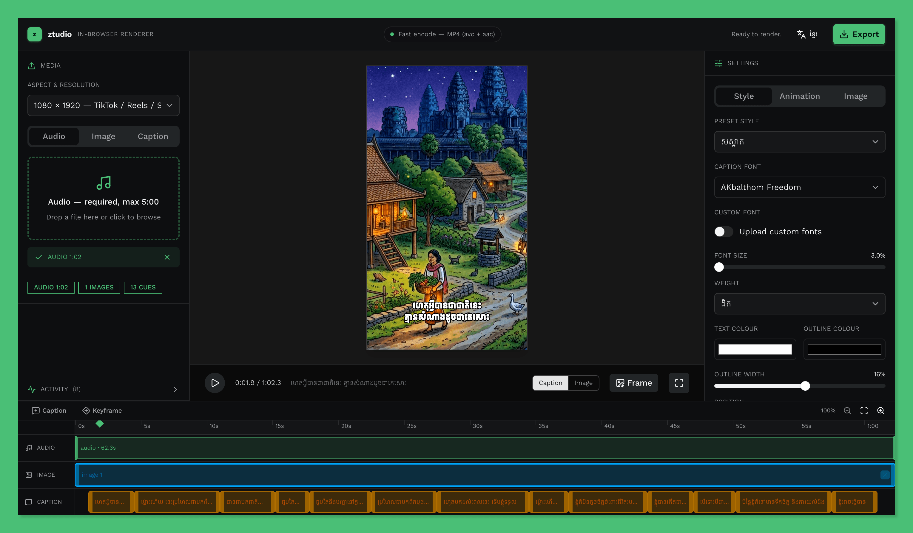
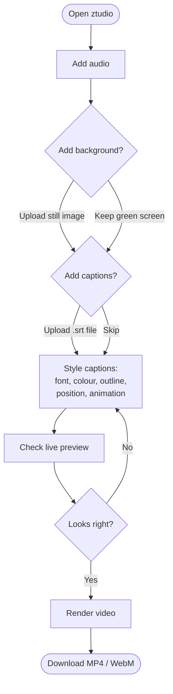

  

<h1 align="center">ztudio</h1>

A fully client-side tool that turns audio + an optional still image + an optional `.srt` caption file into a captioned video — decoded, drawn, and encoded entirely in your browser. No backend, no uploads, nothing leaves your device. Built primarily for Khmer captioning, with a chroma-green default background for keying.

  

## Features

- **100% in-browser** — your audio, images, and captions never get uploaded anywhere.
- **Captioned video from a still** — pair audio with a single background image (or the green screen) and burn in your captions.
- **SRT support** — load a standard `.srt` file and your captions are timed automatically.
- **Khmer-first typography** — bundled Khmer fonts, plus upload your own `.ttf`/`.otf` fonts (saved for next time).
- **Full caption styling** — font, size, weight, colour, outline, position, background box, and entrance animation.
- **Chroma-green background** — the default `#00B140` makes the output easy to key in any video editor.
- **Live preview** — what you see in the preview is exactly what gets rendered.
- **MP4 / WebM export** — encodes to MP4 (H.264 + AAC) where supported, falling back to WebM.
- **Bilingual UI** — English and Khmer (ភាសាខ្មែរ).

## How to use

1. **Add audio.** This sets the length of your video.
2. **Add a background (optional).** Drop in a still image, or leave the green screen for keying.
3. **Add captions (optional).** Upload an `.srt` file to caption the audio.
4. **Style it.** Tweak the font, colours, outline, position, and animation in the caption panel until the live preview looks right.
5. **Export.** Render the video and download the result.

> **Tip:** A mostly-static video (one still image) encodes very fast, since only the caption changes are drawn.

## Browser support

Best experience in a recent Chromium-based browser (Chrome, Edge, Brave) where in-browser video encoding is fastest. Other modern browsers fall back to a slower real-time recording path. An indicator in the app tells you which mode your browser supports.

## Privacy

Everything runs locally. No files are uploaded, and there is no server — close the tab and nothing is retained except the custom fonts you choose to save in your own browser.

## Contributing

Issues and pull requests are welcome.

## License

[MIT](LICENSE)
